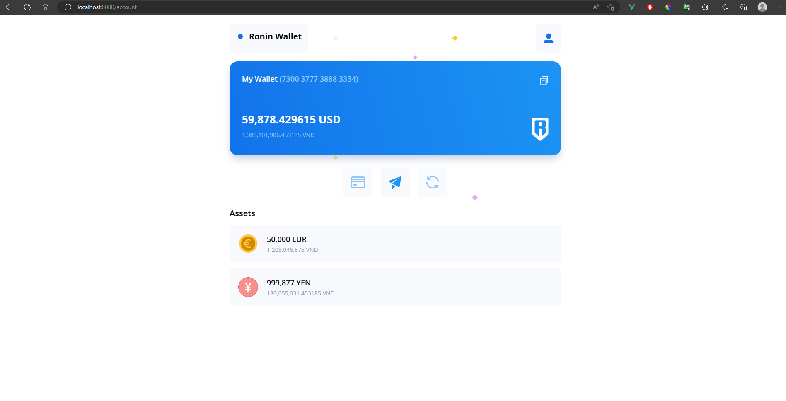
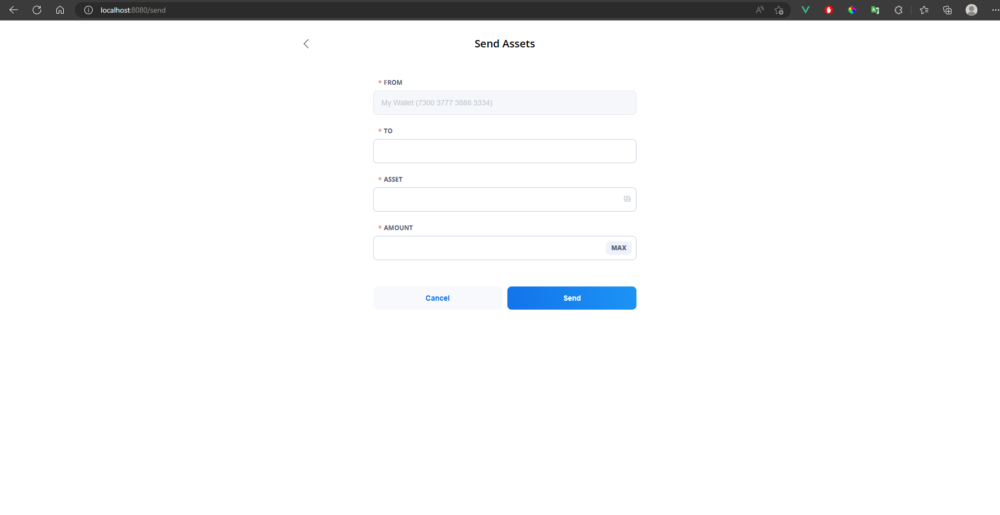

# Ronin Wallet

This is a demo project that use for asset management.

## Demo

In this project, I used some libraries

For Back-end (NodeJS): 
+ express
+ body-parser
+ cors

For Front-End:
+ VueJS
+ VueX
+ VueRouter
+ Axios
+ Lodash
+ ElementUI

##  Project setup
npm install

## Compiles for development
npm run dev

## Compiles and minifies for production
npm run build

## Lints and fixes files
npm run lint

## Customize configuration
See [Configuration Reference](https://cli.vuejs.org/config/).
